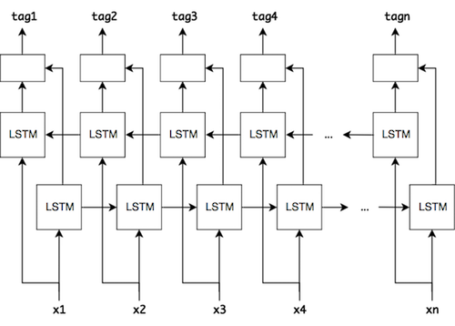
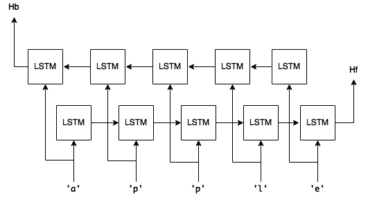

# BiLSTM Phrase Chunker

## Background

Phrase chunking is a basic NLP task that consists of tagging parts of a sentence (1 or more tokens) syntactically.  
### Example

	The quick brown fox jumped over the fence
	|                   |      |    |
	Noun                Verb   Prep Noun

In this example the sentence can be divided into 4 phrases, `The quick brown fox` and `the fence` are noun phrases, `jumped` is a verb phrase and `over` is a prepositional phrase.

## Example Dataset

We used the CoNLL2000 dataset in our example for training a phrase chunker. More info about this dataset can be found [here](https://www.clips.uantwerpen.be/conll2000/chunking/).

The dataset is divided into `train` and `test` sets consisting of 8926 and 2009 sentences fully annotated.
The dataset is implemented in Neon and can be used by creating a `CONLL2000` object from `neon.data.text` module.  
`CONLL2000` supports the following as features for training a model:  

1. sentence tokens directly
2. use pre-train word embedding vector (instead of tokens)
3. part-of-speech tags of tokens
4. character level RNN feature vectors (last vector of BiRNN on each token)

#### Tag format
CoNLL 2000 dataset uses IOB tagging format. Tags begin with a `B-` tag and continue with `I-`. A new `B-` tag marks end of last tag and start of a new tag.  
Example (from above):

	The  quick brown fox  jumped over the  fence
	|    |     |     |    |      |    |    |
	B-NP I-NP  I-NP  I-NP B-VP   B-PP B-NP I-NP

## Model
The Chunker model example comes with several options for creating the NN topology depending on what input is given (tokens/POS/embeddings/char features).



The model above depicts the main topology. 
Given sentence `S` of length `n`, and sentence tokens `S = (s1, s2, .. , sn)` we can input vectors `x1, x2, .., xn` to the model where each sentence position `i` is a vector consisting of the following values:

* token vector embedding using pre-trained word embedding
* token vector embedding (trained by model)
* part-of-speech embedding (trained by model)
* character features vector (trained by char-rnn)

	  
	The Char-RNN feature extractor model uses 2 layers of LSTM such that each RNN layer outputs the last hidden state. The final feature vector for a token is a concatenation of final hidden state of the forward layer `Hf` and the backward `Hb`. In the above example, the word `apple` is encoded to vector `[Hf|Hb]`.
	
Following input vectors are 2 layers of LSTM cells, one LSTM reads input sentence from the token at index `1` to `n` and the other backwards from `n` until `1`. At each time step the forward LSTM layer's hidden state output is concatenated with the backward LSTM hidden state output followed by fully connected layer and a softmax activation that is used for predicting the tag of token `i` from all available tag types (denoted as `(tag_1, tag_2, .., tagn)`).

### Deep BiLSTM

In addition to the model described above, the model support the use of multiple stacked LSTM layers as recent literature has indicated that several layers of RNN layers might be beneficial int sequential prediction.  
When using multiple BiLSTM layers the hidden state of the forward and backward layers are at step `i` are used as the input to the next layer of BiLSTM at step `i` accordingly.


## Usage
### Dependencies
* Neon Deep Learning framework
* spaCy (for POS tags annotation)
	*  Download English model: `python -m spacy download en`
* Install requirements by: `pip install -r requirements.txt`

### Training
#### Quick train
train a model with default parameters (only tokens, default network settings):  
	`python train.py`
#### Custom training parameters
All customizable parameters can be obtained by running:  

```

python train.py -h

  --use_w2v             Use pre-trained word embedding from given w2v model
                        path (default: False)
  --embedding_model EMBEDDING_MODEL
                        w2v embedding model path (only GloVe and Fasttext are
                        supported (default: None)
  --use_pos             Use part-of-speech tags of tokens (default: False)
  --use_char_rnn        Use char-RNN features of tokens (default: False)
  --sentence_len SENTENCE_LEN
                        Sentence token length (default: 100)
  --lstm_depth LSTM_DEPTH
                        Deep BiLSTM depth (default: 1)
  --lstm_hidden_size LSTM_HIDDEN_SIZE
                        LSTM cell hidden vector size (default: 100)
  --token_embedding_size TOKEN_EMBEDDING_SIZE
                        Token embedding vector size (default: 50)
  --pos_embedding_size POS_EMBEDDING_SIZE
                        Part-of-speech embedding vector size (default: 25)
  --vocab_size VOCAB_SIZE
                        Vocabulary size to use (only if pre-trained embedding
                        is not used) (default: 25000)
  --char_hidden_size CHAR_HIDDEN_SIZE
                        Char-RNN cell hidden vector size (default: 25)
  --max_char_word_length MAX_CHAR_WORD_LENGTH
                        max characters per one word (default: 20)
  --model_name MODEL_NAME
                        Model file name (default: chunker)
  --settings SETTINGS   Model settings file name (default: chunker_settings)
  --print_np_perf       Print Noun Phrase (NP) tags accuracy (default: True)
```

Saving the model after training is done automatically:

* `<chunker>.prm` - Neon NN model file
* `<chunker>_settings.dat` - Model topology and input settings

### Inference
To run inference on a trained model one has to have a pre-trained chunker.prm and chunker_settings.dat model files. If the model was trained using pre-trained word embedding the same exact word embedding model should be used.
Running `inference.py` is described below:

	python inference.py -h
		
	  --model MODEL         Path to model file (default: None)
	  --settings SETTINGS   Path to model settings file (default: None)
	  --input INPUT         Input texts file path (samples to pass for inference)
	                        (default: None)
	  --emb_model EMB_MODEL
	                        Pre-trained word embedding model file path (default:
	                        None)
	  --print_only_nps      Print inferred Noun Phrases (default: False)


Quick example:
```
python inference.py --model chunker.prm --parameters chunker_settings.dat --input inference_samples.txt
```  

**Note:** currently char-RNN features are not supported in inference models (will be added soon).

## Performance
* Note - reported performance below is on Noun Phrase (NP) detection (using B-NP and consecutive I-NP labels).

| Model | Precision | Recall | F1 |
|:-------|----------:|-------:|---:|
| CRF   | 0.964 | 0.964 | 0.964 |
| Tokens+BSZ=32+Depth=2+E=5| 0.985 | 0.959 | 0.971 |
| Tokens+W2V+BSZ=32+Depth=2+E=10 | 0.987 | 0.949 | 0.968 |
| FB W2V+BSZ=32+Depth=2+E=5 | 0.977 | 0.952 | 0.965 |

| Model          | Batch size | fprop runtime | Total runtime (sec.) | 
|:---------------|-----------:|--------------:|---------------------:| 
| CRF            | -          | -             | 0.768                | 
| BiLSTM Depth=1 | 1          | 0.096         | 192.864              | 
|                | 16         | 0.177         | 22.125               | 
|                | 32         | 0.204         | 12.648               | 
|                | 64         | 0.365         | 11.315               | 
|                | 128        | 0.603         | 9.045                | 
| BiLSTM Depth=3 | 1          | 0.333         | 668.997              | 
|                | 16         | 0.511         | 63.875               | 
|                | 32         | 0.567         | 35.154               | 
|                | 64         | 0.886         | 27.466               | 
|                | 128        | 1.582         | 23.73                | 
