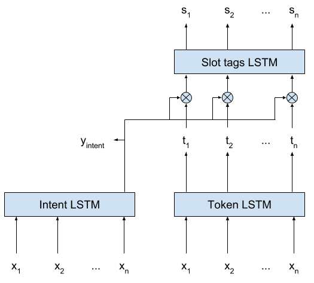
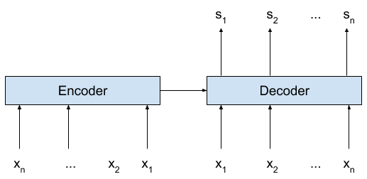

# Sequential models for Intent Extraction

Intent extraction is a type of Natural-Language-Understanding (NLU) task that helps to understand the type of action conveyed in the sentences and all its participating parts.

An example of a sentence with intent could be:

```
Siri, can you please remind me to pickup my laundry on my way home?
```

The action conveyed in the sentence is to *remind* the speaker about something. The verb *remind* implies that there is an assignee that has to do the action (who?), an assignee that the action applies to (to whom?) and the object of the action (what?). In this case, *Siri* has to remind the *speaker* to *pickup the laundry*.

### Joint Intent classification and Slot tagging

In this model we aim to detect the intent type and slot tags (the intent frame participants) jointly.
The network input consists of sentence `S` of length `n`, and sentence tokens `S = (x_1, x_2, .., x_n)`. The last output of the LSTM layer is used to predict the class of the intent (using softmax). The network on the right is used for predicting the tag of each token (slot tagging task) using the intent detected in the intent type classifier. The output of the intent network is concatenated with each embedded representation of the tokens of sentence `S`, using a bi-directional LSTM, and fed into another bi-directional LSTM layer for predicting the slot tags. The slot classification is done using the softmax output in each time stamp. This model is a deriviative of the models presentend in [1].



### Encoder-Decoder topology for Slot Tagging

The Encoder-Decoder LSTM topology is a well known model for sequence-to-sequence classification. The model we implemented is similar to the *Encoder-Labeler Deep LSTM(W)* model shown in [2].
Our model support arbitrary depths of LSTM layers in both encoder and decoder.



## Dependencies

- Dependencies required for the project are mentioned in requirements.txt, Use `pip install -r requirements.txt` to install.
- Please [configure](https://keras.io/backend/) Keras to use Tensorflow as backend.
- Download English model for spacy: `python -m spacy download en`
- Pre-trained word vector embedding models:
    - [GloVe](https://nlp.stanford.edu/projects/glove/)
    - [Fasttext](https://fasttext.cc/docs/en/english-vectors.html) 

## Files

- *data.py*: Implements dataloader for The Airline Travel Information System (ATIS) and SNIPS datasets.
- *model.py*: Implementation of Encoder-Decoder slot classifer and Joint Intent detection/slot classifier model.
- *train_enc-dec_model.py*: training script to train a joint intent/slot tag model.
- *train_joint_model.py*: training script to train an encoder-decoder slot tag model.
- *interactive.py*: Inference script to run an input sentence using a trained model.
- *utils.py*: Utilities to support data loading, Conll benchmark and various data manipulation.

## Datasets

The dataset are downloaded automatically and consist on a train/test files. Each file is contains a token which is a part of a sentence, the token's slot tag and the sentence intent type.

### ATIS

The Airline Travel Information System (ATIS) [3, 4] consists of spoken queries on flight related information, such as flight schedule, meal information, available public transportation, etc.
The dataset was split to train/test sets made of 4978/893 sentences, vocabulary size of 943, 26 type of intents and 129 slot tags (including the null tag 'O') which were encoded in BIO format.

### SNIPS NLU benchmark

A NLU benchmark containing ~16K sentences with 7 intent types. Each intent has about 2000 sentences for training the model and 100 sentences for validation. The included data files were encoded using BIO format for slot tags.

More details on the dataset can be found in the following github [repo](https://github.com/snipsco/nlu-benchmark), and in [this](https://medium.com/snips-ai/benchmarking-natural-language-understanding-systems-google-facebook-microsoft-and-snips-2b8ddcf9fb19) blog post.

## Training

Training the joint task model (predicts slot tags and intent type) using ATIS and saving the model weights to `my_model.h5`:

```
python train_joint_model.py --dataset atis --model_path my_model.h5
```

Training an Encoder-Decoder model (predicts slot tags) using SNIPS, GloVe word embedding model of size 100 and saving the model weights to `my_model.h5`:

```
python train_enc-dec_model.py --dataset atis --embedding_path <path_to_glove_100_file> --token_emb_size 100 --model_path my_model.h5
```

To list all possible parameters: `python train_joint_model.py/train_enc-dec_model.py -h`

## Interactive mode

Interactive mode allows to run sentences on a trained model (either of two) and get the results of the models displayed interactively.
An interactive session requires the dataset the model that was used when training the modeland the path/size of the embedding model (if used).
Example:

```
python interactive.py --model_path my_model.h5 --dataset atis
```

## Results
Results for both dataset published below. The reference results were taken from the originating paper. Minor differences might occur in final results. Each model was trained for 100 epochs with default parameters. 


ATIS -

| |Joint task| Encoder-Decoder | [1] | [2] |
|-|-|-|-|-|
|Slots|95.52|93.74|95.48|95.47|
|Intent|96.08|-|-|-|

SNIPS -

| |Joint task| Encoder-Decoder | 
|-|-|-|
|Slots|93.68|85.96|
|Intent|99.14|-|

## Citation

[1] Hakkani-Tur, Dilek and Tur, Gokhan and Celikyilmaz, Asli and Chen, Yun-Nung and Gao, Jianfeng and Deng, Li and Wang, Ye-Yi [Multi-Domain Joint Semantic Frame Parsing using Bi-directional RNN-LSTM](https://www.csie.ntu.edu.tw/~yvchen/doc/IS16_MultiJoint.pdf).

[2] Gakuto Kurata, Bing Xiang, Bowen Zhou, Mo Yu. [Leveraging Sentence-level Information with Encoder LSTM for Semantic Slot Filling](https://arxiv.org/abs/1601.01530).

[3] C. Hemphill, J. Godfrey, and G. Doddington, The ATIS spoken
language systems pilot corpus, in Proc. of the DARPA speech and
natural language workshop, 1990.

[4] P. Price, Evaluation of spoken language systems: The ATIS domain,
in Proc. of the Third DARPA Speech and Natural Language
Workshop. Morgan Kaufmann, 1990.
